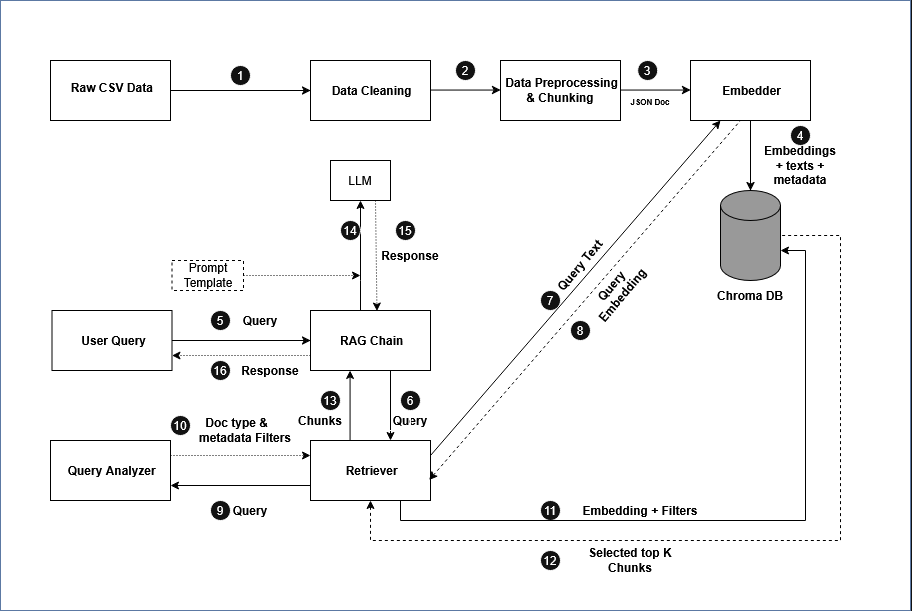

# Sales Analytics RAG System

A Retrieval-Augmented Generation system that answers natural language questions about 4 years of retail superstore sales data (2014-2017) using a local LLM via Ollama and ChromaDB as the vector store.

## Table of Contents
- [Overview](#overview)
- [Architecture](#architecture)
- [Project Structure](#project-structure)
- [Prerequisites](#prerequisites)
- [Installation](#installation)
- [Ollama Setup](#ollama-setup)
- [Running the Project](#running-the-project)
- [Usage](#usage)
- [Configuration](#configuration)
- [Troubleshooting](#troubleshooting)

## Overview
- Dataset: Superstore sales dataset, 9,994 transactions, 2014-2017
- What the system can answer: trend analysis, category analysis, regional analysis, comparative analysis
- Key design decisions:
	- ChromaDB: lightweight embedded vector store, no server required
	- nomic-embed-text: 8192 token context window, runs via Ollama
	- LangChain: orchestration layer for retrieval and generation
	- Ollama: fully local LLM inference, no API key required

## Architecture



The system has two pipelines. The Ingestion Pipeline flows from chunks.json to a Loader & Validator, then into the Embedder (nomic-embed-text) and finally into ChromaDB. The Query Pipeline starts with User Input, passes through the Query Analyzer (intent + metadata filters), then Retriever and ChromaDB (similarity search + metadata filtering), followed by the Prompt Builder and Ollama LLM, returning a Response + Sources.

## Project Structure

```
sales-rag/
├── data/
│   └── datastore/               # auto-created, stores chunks.json output
├── eda/
│   ├── explore_data.py          # exploratory data analysis on raw dataset
│   └── chunk_analysis.py        # analysis the chunk lengths
├── resources/
│   └── images/
│       └── architecture.png     # system architecture diagram
├── src/
│   ├── config.py                # loads .env, exposes typed config
│   ├── ingest/
│   │   └── loader.py            # loads and validates chunks.json
│   ├── vectorstore/
│   │   ├── embedder.py          # nomic-embed-text via Ollama
│   │   └── store.py             # ChromaDB operations
│   ├── retriever/
│   │   ├── query_analyzer.py    # rule-based intent and filter detection
│   │   └── retriever.py         # similarity search + context formatting
│   └── pipeline/
│       ├── prompt_templates.py  # LangChain prompt templates
│       └── rag_chain.py         # end-to-end RAG chain
├── scripts/
│   ├── data_prep.py             # reads raw dataset from data/, outputs chunks.json to data/datastore/
│   ├── run_ingestion.py         # one-shot ingestion pipeline
│   ├── query_cli.py             # interactive query interface
│   ├── verify_store.py          # debug: inspect ChromaDB contents
│   └── smoke_test.py            # debug: run 3 test questions
├── chroma_store/                # auto-created by ChromaDB, do not edit
├── .env.example                 # copy to .env and configure
├── .gitignore
└── requirements.txt
```

## Prerequisites
- Python 3.10+
- Ollama (installed as a separate application, not via pip)
- 8GB RAM minimum (16GB recommended for mistral 7B)
- Linux / macOS / Windows (WSL2 recommended on Windows)

## Installation

Step 1 - Extract the project zip file:

Unzip the provided sales-data-analysis-rag-system.zip file:

```
unzip sales-data-analysis-rag-system.zip
cd sales-data-analysis-rag-system
```

Step 2 - Create and activate a virtual environment:

Linux/macOS:

```
python -m venv venv
source venv/bin/activate
```

Windows:

```
python -m venv venv
venv\Scripts\activate
```

Step 3 - Install Python dependencies:

```
pip install -r requirements.txt
```

Step 4 - Set up environment variables:

Linux/macOS:

```
cp .env.example .env
```

Windows:

```
copy .env.example .env
```

Open .env and adjust values if needed (see Configuration section).

## Ollama Setup

Step 1 - Install Ollama:

Download and install from https://ollama.com/download for your OS.

Linux:

Ollama installs as a systemd service automatically.
To prevent auto-start on boot:

```
sudo systemctl disable ollama
```

macOS:

Ollama installs as a menu bar application and starts automatically on login. To disable auto-start, go to:

System Settings → General → Login Items → remove Ollama

Windows:

Run the installer. Ollama runs as a background service automatically. To stop it: open Task Manager → find Ollama → End Task

Step 2 - Pull required models:

```
ollama pull nomic-embed-text
ollama pull mistral
# Optional alternative LLM:
ollama pull llama3.2:3b
```

Step 3 - Start Ollama on demand:

Linux (systemd):

```
sudo systemctl start ollama
# Stop when done:
sudo systemctl stop ollama
```

macOS:

```
ollama serve
# Stop: Ctrl+C
```

Windows (Command Prompt):

```
ollama serve
# Stop: Ctrl+C
```

Step 4 - Verify Ollama is running:

```
curl http://localhost:11434
# Expected response: Ollama is running
```

Step 5 - Verify models are available:

```
ollama list
# Should list: nomic-embed-text, mistral (and llama3.2:3b if pulled)
```

## Running the Project

Step 1 - (Optional) Run data preparation:

This step reads the raw dataset from data/ and produces chunks.json in data/datastore/. Skip this step if chunks.json is already provided.

```
python scripts/data_prep.py
```

Step 2 - (Optional) Run ingestion:

This step embeds all chunks and stores them in ChromaDB. Skip this step if the chroma_store/ directory is already populated.

```
python scripts/run_ingestion.py
```

Options:

```
--chunks-file PATH    path to chunks.json
											(default: ./data/datastore/chunks.json)
--reset               wipe and re-ingest the collection
```

Examples:

```
python scripts/run_ingestion.py
python scripts/run_ingestion.py --chunks-file ./data/datastore/chunks.json
python scripts/run_ingestion.py --reset
```

Step 3 - (Optional) Verify the store was populated correctly:

```
python scripts/verify_store.py
```

Step 4 - (Optional) Run smoke test to confirm the full pipeline works:

```
python scripts/smoke_test.py
```

Step 5 - Launch the interactive CLI:

```
python scripts/query_cli.py
```

## Usage

The interactive CLI:
- On startup, shows the active model name and total document count in ChromaDB
- Displays a numbered list of predefined analytical questions covering trends, categories, regions, and comparisons
- User can pick a number to select a predefined question or type any free-form question directly
- Available commands:
	- /debug    toggle debug mode (shows detected filters and chunk scores)
	- /model    show currently active model name
	- /count    show total number of documents in ChromaDB
	- /help     show available commands
	- /exit     quit the program

## Configuration

| Variable           | Default                    | Description                          |
|--------------------|----------------------------|--------------------------------------|
| OLLAMA_BASE_URL    | http://localhost:11434     | Ollama server URL                    |
| MODEL_NAME         | mistral                    | LLM for generation (mistral recommended, llama3.2:3b as alternative) |
| EMBEDDING_MODEL    | nomic-embed-text           | Embedding model (served via Ollama)  |
| CHROMA_PERSIST_DIR | ./chroma_store             | ChromaDB persistence directory       |
| COLLECTION_NAME    | sales_rag                  | ChromaDB collection name             |
| TOP_K              | 16                          | Number of chunks retrieved per query |

Note: To switch to llama3.2:3b, set MODEL_NAME=llama3.2:3b in .env and ensure you have run: ollama pull llama3.2:3b

## Troubleshooting

**Ollama is not running**
	curl returns connection refused or similar error
	→ Start Ollama: ollama serve
	→ On Linux with systemd: sudo systemctl start ollama

**Model not found**
	Error mentions model not found or needs to be pulled
	→ Run: ollama pull mistral
	→ Run: ollama pull nomic-embed-text

**ChromaDB collection already exists**
	Ingestion script exits with "Collection already populated"
	→ Run with reset flag:
		python scripts/run_ingestion.py --reset
	→ OR change the `COLLECTION_NAME` config in .env

**chunks.json not found**
	Ingestion script cannot find the input file
	→ Run data preparation first:
		python scripts/data_prep.py
	→ Or verify the file exists at data/datastore/chunks.json
